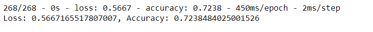

# Neural_Network_Charity_Analysis
## Overview of Project
In Neural network Analysis project we are applying the skills of preprocessing the data for the neural network model, compile, train, evaluate and then optimize the model. Pandas and Scikit-Learn’s standard scaler is used to preprocess the dataset in order to compile, train and evaluate the neural network model using TensorFlow.

## Analysis
Preprocessing included dropping the EIN and NAME column, unique values were determined for each column and then number of datapoints were determined for those unique values. Density plot was taken to determine the distribution.

Categorical variables are encoded using one-hot encoding and variables are placed in dataframe

Model is optimized using increasing neurons and activation functions has been changed, noisy variables have been removed in all three attempts.

## Summary:
Maximum accuracy achieved through optimization was around 73%. More experimentation should be done on optimizing the model to achieve our target of 75% accuracy.
